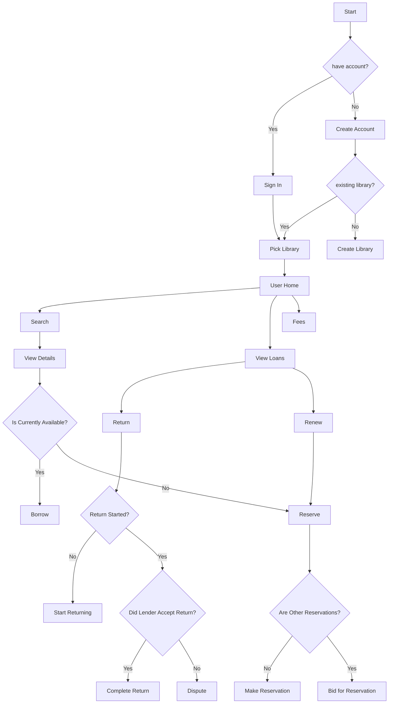

# webclient

```mermaid
flowchart TD
    start[Start] --> haveAccount{have account?}
    haveAccount -- Yes --> signin[Sign In]
    haveAccount -- No --> create[Create Account]
    
    create --> existingLibrary{existing library?}
    existingLibrary -- Yes --> pickLibrary
    existingLibrary -- No --> createLibrary[Create Library]
    
    signin --> pickLibrary[Pick Library]
    pickLibrary --> userHome[User Home]
    userHome --> search[Search]
    userHome --> viewLoans[View Loans]
    userHome --> fees[Fees]
    viewLoans --> return[Return]
    
    return --> isReturnStarted{Return Started?}
    isReturnStarted -- No --> startReturning[Start Returning]
    isReturnStarted -- Yes --> didLenderAcceptReturn{Did Lender Accept Return?}
    didLenderAcceptReturn -- Yes --> completeReturn[Complete Return]
    didLenderAcceptReturn -- No --> dispute[Dispute]
    viewLoans --> renew[Renew]
    
    search --> viewDetails[View Details]
    viewDetails --> isCurrentlyAvaialble{Is Currently Available?}
    isCurrentlyAvaialble -- Yes --> borrow[Borrow]
    isCurrentlyAvaialble -- No --> reserve[Reserve]
    reserve --> areOtherReservations{Are Other Reservations?}
    areOtherReservations -- No --> makeReservation[Make Reservation]
    areOtherReservations -- Yes --> bidForReservation[Bid for Reservation]
    
    renew --> reserve
```
